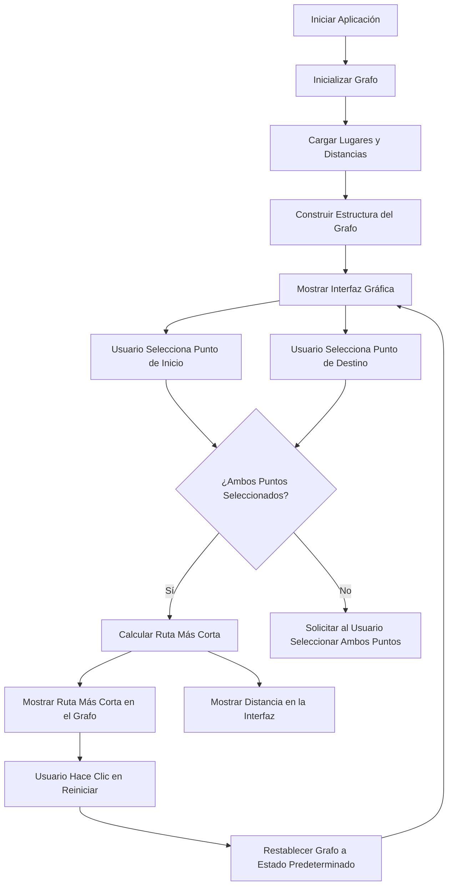

---

# **Sistema de Navegación UDLAP**

Este proyecto es un sistema de navegación basado en grafos que permite calcular y visualizar la ruta más corta entre los edificios clave del campus de la Universidad de las Américas Puebla (UDLAP). El sistema incluye una interfaz interactiva donde los usuarios pueden seleccionar el punto de inicio y destino, visualizar el grafo, y resaltar la ruta óptima.

---

## **Instalación**

### **Requisitos previos**
1. Tener **Python 3.8 o superior** instalado.
2. Instalar las bibliotecas requeridas para el proyecto.

### **Instalación de dependencias**
En el directorio del proyecto, instala las dependencias necesarias ejecutando:

```bash
pip install -r requirements.txt
```

El archivo `requirements.txt` incluye las siguientes dependencias:
- `matplotlib`
- `networkx`

---

## **Ejecución del sistema**

Para iniciar el sistema, ejecuta el archivo principal desde la terminal:

```bash
python main.py
```

Esto abrirá la interfaz gráfica del sistema.

---

## **Uso del sistema**

### **Interfaz gráfica**
1. **Selección de puntos**:
   - En la barra lateral izquierda, selecciona un punto de inicio (nodo) y un punto de destino (nodo) desde los menús desplegables.

2. **Cálculo de la ruta**:
   - Haz clic en el botón **"Calculate Path"**.
   - El sistema calculará la ruta más corta entre los puntos seleccionados y resaltará el camino en el grafo (color rojo).
   - La distancia total y la ruta se mostrarán en la barra lateral.

3. **Reiniciar el grafo**:
   - Haz clic en el botón **"Reset Graph"** para reiniciar el grafo a su estado inicial, eliminando las rutas resaltadas.

### **Visualización del grafo**
- El grafo muestra los edificios seleccionados como nodos y las conexiones entre ellos como aristas.
- Las distancias entre los edificios están ponderadas según mediciones aproximadas obtenidas de Google Earth.

---

## Diagram de clases UML



